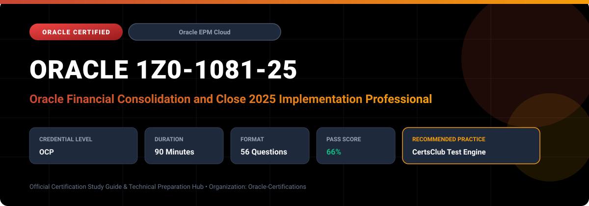

  

# Oracle 1Z0-1081-25: Oracle Financial Consolidation and Close 2025 Implementation Professional

---

## 1. Exam Overview & Candidate Profile

The **Oracle 1Z0-1081-25: Oracle Financial Consolidation and Close 2025 Implementation Professional** examination is engineered for enterprise architects, solution specialists, functional consultants, and implementation professionals seeking formal industry recognition of their proficiency in Oracle technologies.

The Oracle Financial Consolidation and Close 2025 Implementation Professional (1Z0-1081-25) certification demonstrates candidate proficiency in implementing and administering Oracle Financial Consolidation and Close (FCCS) Cloud. Candidates validate their ability to set up consolidation applications, configure consolidation rules, manage currency translation, handle intercompany eliminations, maintain ownership structures, and orchestrate the financial close calendar.

### Target Audience & Prerequisites
- **Target Roles**: Implementation Specialists, Cloud Architects, Technical Leads, Enterprise Functional Consultants, and Systems Engineers.
- **Recommended Experience**: 1–2 years of practical, hands-on experience designing, implementing, and maintaining corresponding Oracle Cloud solutions.
- **Credential Earned**: Oracle Certified Professional (OCP).

---

## 2. Key Exam Specifications

| Specification | Details |
| :--- | :--- |
| **Exam Code** | **Oracle 1Z0-1081-25** |
| **Official Title** | Oracle Financial Consolidation and Close 2025 Implementation Professional |
| **Certification Track** | Oracle Enterprise Performance Management Cloud |
| **Exam Duration** | 90 Minutes |
| **Number of Questions** | 56 Questions |
| **Passing Score** | 66% |
| **Question Format** | Multiple Choice (Single/Multiple Answer), Scenario-Based Questions |
| **Delivery Provider** | Oracle University / Pearson VUE (Online Proctored or Test Center) |
| **Recommended Practice Engine** | [CertsClub Oracle Practice Tests](https://www.certsclub.com/oracle/1z0-1081-25-dumps.html) |

---

## 3. Official Blueprint & Exam Domain Breakdown

The examination assesses candidate competencies across core functional domains weighted as follows:

| Domain Area | Weighting |
| :--- | :--- |
| **FCCS Application Setup, Dimensions & Architecture** | `25%` |
| **Consolidation Process, Rules & Multi-GAAP Setup** | `25%` |
| **Intercompany Eliminations & Ownership Management** | `20%` |
| **Currency Translation & Equity Adjustments** | `15%` |
| **Close Manager, Supplemental Data & Task Management** | `15%` |

---

## 4. Deep Dive into Complex & Challenging Technical Topics

To secure a passing score on the 1Z0-1081-25 exam, candidates must master the following advanced concepts:

- **Predefined and custom dimensions**: Consolidation, View, Movement, Multi-GAAP, and Data Source.
- Consolidation mechanics, calculation status (Impacted, System Change, OK), and Configurable Consolidation Rules.
- Automated Intercompany balance matching, elimination journal entries, and plugging accounts.
- Close Manager task templates, dependency chains, event triggers, and Supplemental Data forms.

---

## 5. Scenario-Based Demo & Practice Questions

### Question 1
In Oracle Financial Consolidation and Close Cloud (FCCS), which system dimension tracks whether data represents base local currency, translated currency, or elimination adjustments?

A) Consolidation Dimension
B) View Dimension
C) Movement Dimension
D) Entity Dimension

- **Correct Answer**: `A) Consolidation Dimension`  
- **Technical Explanation**: The Consolidation dimension contains members such as FCCS_Entity Input, FCCS_Entity Total, FCCS_Proportion, and FCCS_Elimination, tracking values through the consolidation path.

---

### Question 2
Which dimension in FCCS is purpose-built to categorize cash flow movements, opening balances, closing balances, and balance sheet rollforwards?

A) Movement Dimension
B) Account Dimension
C) Scenario Dimension
D) Multi-GAAP Dimension

- **Correct Answer**: `A) Movement Dimension`  
- **Technical Explanation**: The Movement dimension records changes in accounts from period to period, facilitating automated cash flow reporting and balance sheet movement tracking.

---

## 6. Recommended Preparation Strategy & Practice Testing Engine

Achieving certification in **Oracle 1Z0-1081-25** requires balanced theoretical study and scenario-based simulation practice:

1. **Review Oracle Documentation**: Master architecture guides, implementation workbooks, and administration manuals on the Oracle Help Center.
2. **Hands-on Lab Practice**: Execute real-world configuration, policy setup, and troubleshooting tasks in your cloud tenancy or test instance.
3. **Simulated Exam Drills**: Practice answering timed, scenario-based multiple-choice questions to familiarize yourself with the question formats, traps, and timing constraints.

### Practice With CertsClub
For realistic practice questions, updated dumps, and mock testing environments:
- **Resource**: [CertsClub Oracle Practice Test Engine](https://www.certsclub.com/oracle/1z0-1081-25-dumps.html)
- **Special Discount**: Use coupon code **`club20`** during checkout for an instant **20% discount** on all practice exam bundles and testing engines.

---

## 7. Official Documentation & References

- [Oracle University Certification Registry](https://education.oracle.com/)
- [Oracle Help Center Documentation Portal](https://docs.oracle.com/)
- [Oracle Cloud Infrastructure & Applications Guides](https://docs.oracle.com/en/cloud/)
- [CertsClub Oracle Certification Exam Practice](https://www.certsclub.com/oracle/1z0-1081-25-dumps.html)

---

## 8. SEO & Discovery Keywords

`oracle 1z0-1081-25, oracle 1z0-1081-25 exam, oracle 1z0-1081-25 dumps, 1Z0-1081-25 practice questions, 1Z0-1081-25 study guide, oracle 1z0-1081-25 syllabus, oracle financial consolidation and close 2025 implementation professional, certsclub 1z0-1081-25`
